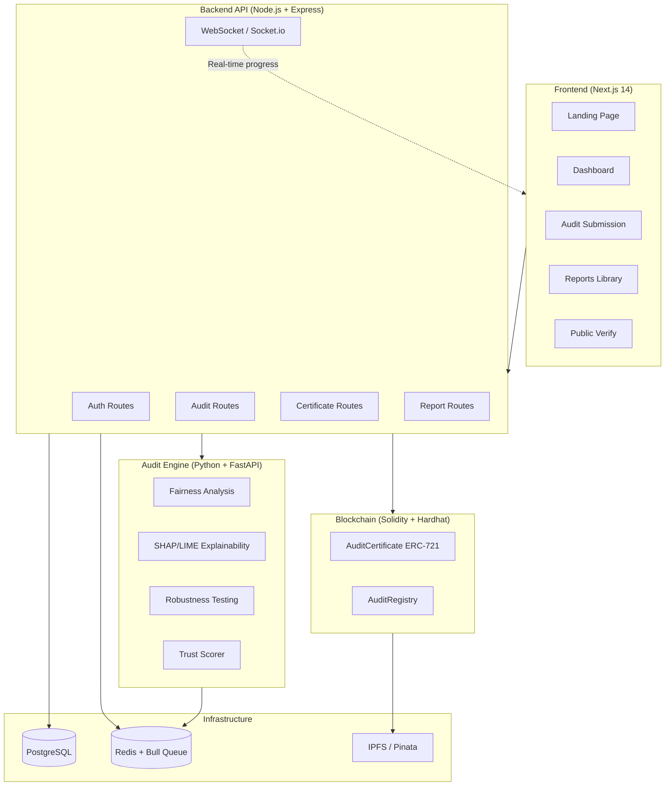

# AuditChain — AI Model Auditing Platform

> Independent AI/ML model auditing with blockchain-certified results. Submit your model for fairness, explainability, and robustness analysis — get a tamper-proof certificate.

## Architecture



## Tech Stack

| Layer | Technology |
|-------|-----------|
| Frontend | Next.js 14, TypeScript, Tailwind CSS, shadcn/ui |
| Backend API | Node.js, Express, Prisma ORM, Socket.io |
| Audit Engine | Python 3.11, FastAPI, scikit-learn, SHAP, AIF360 |
| Blockchain | Solidity 0.8.20, Hardhat, ethers.js, OpenZeppelin |
| Database | PostgreSQL 15 |
| Queue | Bull + Redis |
| Auth | JWT + bcrypt (refresh token rotation) |

## Quick Start

### Prerequisites
- Docker & Docker Compose
- Node.js 20+
- Python 3.11+

### 1. Clone and configure

```bash
git clone <repo>
cd auditchain
cp .env.example .env
# Edit .env with your values
```

### 2. Start everything with Docker

```bash
make up
# Or: docker-compose up -d
```

This starts:
- PostgreSQL on port 5432
- Redis on port 6379
- API server on port 3001
- Next.js frontend on port 3000
- Python audit engine on port 8001

### 3. Run database migrations + seed

```bash
make migrate
make seed
```

### 4. Deploy smart contracts (local)

```bash
# In another terminal, start Hardhat node
cd packages/contracts && npx hardhat node

# Deploy contracts
make deploy-local

# Copy contract addresses from output to your .env
```

### 5. Access the app

- **Frontend**: http://localhost:3000
- **API**: http://localhost:3001
- **Audit Engine**: http://localhost:8001
- **API Docs**: http://localhost:8001/docs

### Demo Credentials

After seeding the database:

| Role | Email | Password |
|------|-------|---------|
| Admin | admin@auditchain.io | Demo1234! |
| Auditor | auditor@auditchain.io | Demo1234! |
| Client | client@fintech.ai | Demo1234! |

## Project Structure

```
auditchain/
├── packages/
│   ├── web/           # Next.js 14 frontend
│   ├── api/           # Express backend + Prisma
│   ├── contracts/     # Solidity smart contracts
│   └── audit-engine/  # Python fairness/explainability engine
├── sample-model/      # Pre-trained demo model for testing
├── docker-compose.yml
├── Makefile
└── .env.example
```

## API Reference

### Authentication
| Method | Endpoint | Description |
|--------|----------|-------------|
| POST | `/api/auth/register` | Register new org + user |
| POST | `/api/auth/login` | Login → access + refresh tokens |
| POST | `/api/auth/refresh` | Rotate refresh token |
| POST | `/api/auth/logout` | Invalidate refresh token |
| GET | `/api/auth/me` | Get current user |

### Audits
| Method | Endpoint | Description |
|--------|----------|-------------|
| POST | `/api/audits` | Submit new audit (multipart) |
| GET | `/api/audits` | List audits (paginated) |
| GET | `/api/audits/:id` | Get audit details |
| DELETE | `/api/audits/:id` | Delete audit (Admin only) |

### Certificates
| Method | Endpoint | Description |
|--------|----------|-------------|
| POST | `/api/certs/mint` | Mint NFT certificate (Auditor+) |
| GET | `/api/certs/verify/:tokenId` | **Public** verify by token ID |
| GET | `/api/certs/lookup` | **Public** lookup by hash/ID |
| POST | `/api/certs/revoke/:tokenId` | Revoke certificate (Admin) |

### Reports
| Method | Endpoint | Description |
|--------|----------|-------------|
| GET | `/api/reports` | List completed reports |
| GET | `/api/reports/:auditId` | Get full report data |
| GET | `/api/reports/:auditId/pdf` | Download PDF report |
| GET | `/api/reports/:auditId/export` | Export as JSON or CSV |

### Audit Engine (Python — internal)
| Method | Endpoint | Description |
|--------|----------|-------------|
| POST | `/analyze/fairness` | Run fairness analysis |
| POST | `/analyze/explainability` | SHAP/LIME analysis |
| POST | `/analyze/robustness` | Adversarial + stress tests |
| POST | `/upload-model` | Upload model file |

## Trust Score

The composite trust score (0-100) is weighted:

| Dimension | Weight | Measures |
|-----------|--------|---------|
| Fairness | 35% | Demographic parity, equalized odds, disparate impact |
| Explainability | 25% | SHAP clarity, LIME consistency |
| Robustness | 25% | Adversarial perturbation resistance, edge case handling |
| Documentation | 15% | Model card quality (future: automated assessment) |

## Smart Contracts

### AuditCertificate (ERC-721)
- Non-transferable NFT — each cert is permanently bound to an audit
- On-chain data: audit ID, model hash, score, IPFS report CID, timestamp
- Access controlled: only `AUDITOR_ROLE` can mint/revoke

### AuditRegistry
- Public append-only registry of all audits
- Query by model hash or organization address
- Events: `AuditRegistered`, `CertificateIssued`, `CertificateRevoked`

## Testing

```bash
# All tests
make test

# Individual
make test-api        # Jest tests for API routes
make test-engine     # Pytest for Python engine
make test-contracts  # Hardhat tests for smart contracts
```

## Deployment

### Sepolia Testnet
```bash
# Set SEPOLIA_RPC_URL and AUDITOR_PRIVATE_KEY in .env
make deploy-sepolia
```

### Production
- Use a hosted PostgreSQL (Railway, Supabase, RDS)
- Use Upstash Redis or Redis Cloud
- Deploy contracts to mainnet or L2 (Polygon, Arbitrum)
- Use Pinata or nft.storage for IPFS report hosting
- Set `NODE_ENV=production` and proper secrets

## License

MIT
